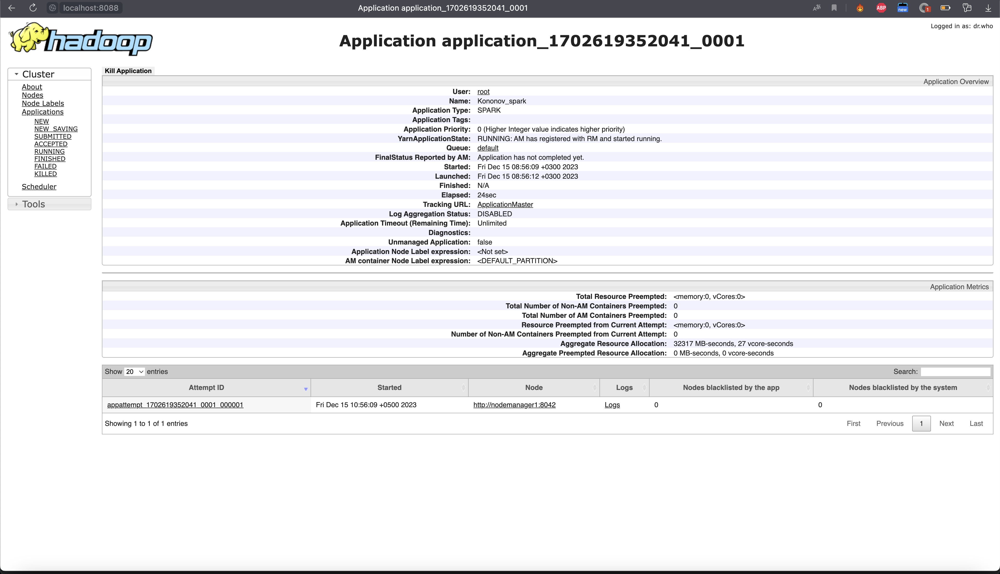
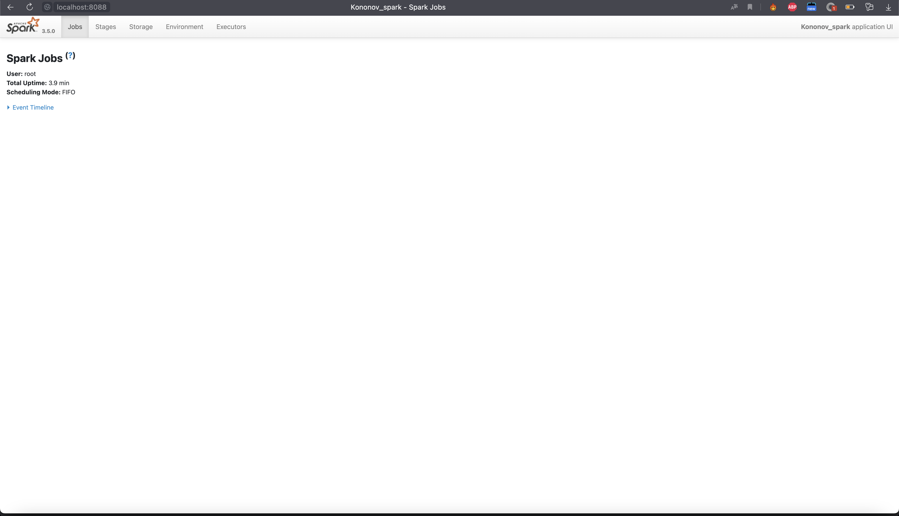
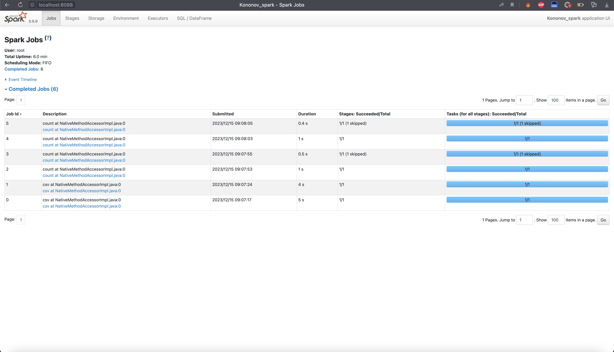
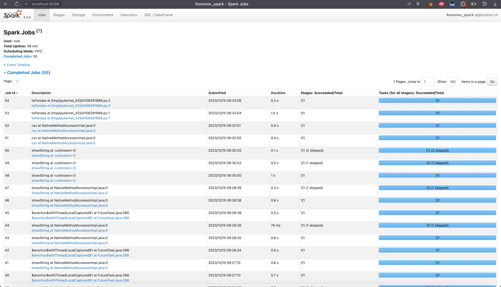

# Spark-HW2
spark homework

# Скрин из yarn

# Скрин ui запущенного спарка

# Скрин ui запущенного спарка после count в ratins и tags

# Джоб 6 штук.
# Зайдя в джобу, можно увидеть стейджи для задачи. Выполненных стейджей по итогу по одному в каждой джобе.
# В каждом стейдже по одной выполненной таске.

# Итого 6 стейджей и 6 тасок. Как я все вызывал представлено в ноутбуке

# На всякий случай скрин UI спарка после выполнения всех расчетов из ДЗ
